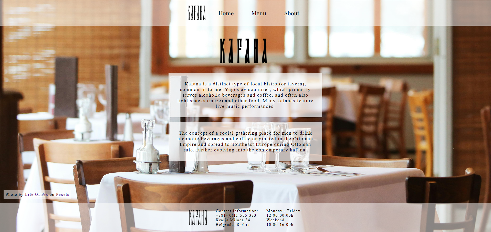
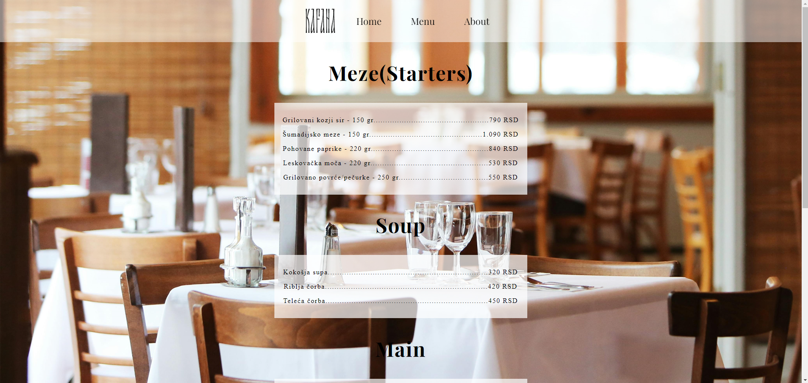
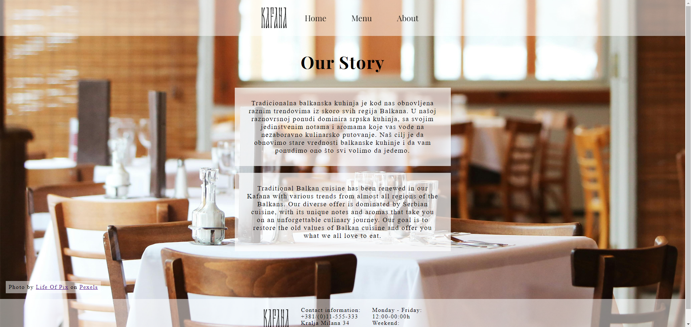

# Restaurant Page

This is a Restaurant page project created as part of The Odin Project curriculum.

## What I learned

* Learned about npm, webpack, bundling and how to use them
* Started using ES6 modules, structuring code into multiple files and importing and exporting functions

---------------------------------------------------------------------------------------------------------------

